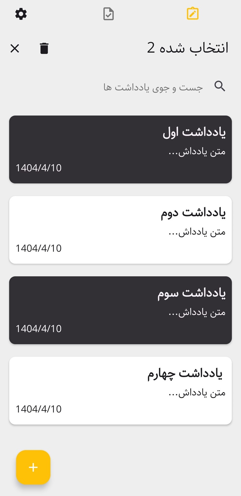
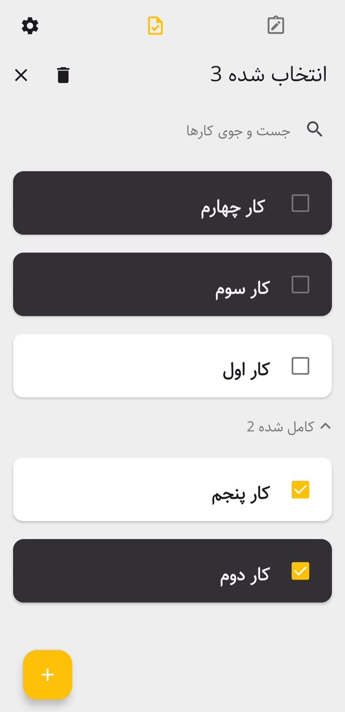
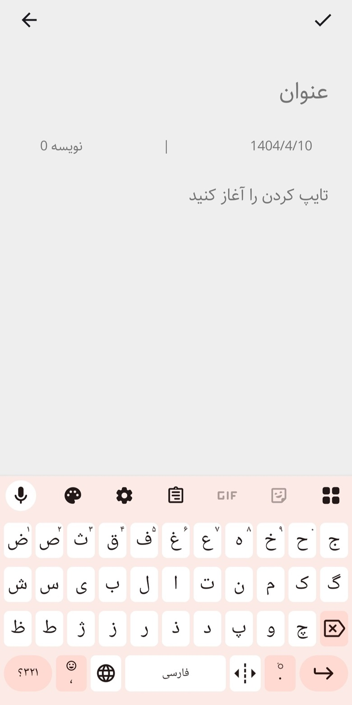
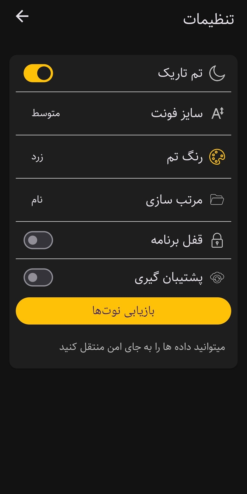

# NoteApp


NoteApp is a modern, lightweight, and highly customizable note-taking application built entirely with Jetpack Compose and powered by MVVM architecture. Designed for simplicity and efficiency, it allows users to manage notes seamlessly with features like dark mode, backup, and app lock.


# NoteApp – Jetpack Compose Note-Taking App with MVVM Architecture

## Features
- ✏️ Create, edit, and delete personal notes
- 🌙 Dark mode support for comfortable reading at night
- 🎨 Customize theme color, font size, and language
- 🔒 Lock the app to protect private notes
- ☁️ Backup and restore your notes anytime
- ⚡ Smooth navigation with Jetpack Compose and MVVM


## Prerequisites
Before you build and run the project, make sure you have the following installed:
- Android Studio Hedgehog (or newer)
- JDK 11
- Gradle 8.14.3+
- Kotlin 2.2.0+
- Android Gradle Plugin (AGP) 8.11.1+
- Minimum SDK: 30
- Compile SDK: 36
- Target SDK: 36


## Used Technologies & Libraries
- Jetpack Compose (UI toolkit)
- MVVM architecture
- Room (local database)
- Hilt (dependency injection)
- Lottie (animations)
- Navigation-Compose
- DataStore Preferences
- Coroutines (asynchronous programming)
- Gson (JSON parsing)

## Screenshots

<div align="center">

<table>
  <tr>
    <td align="center">
      <br/>
      <sub><b>Note Screen</b><br/>List of notes</sub>
    </td>
    <td width="30"></td>
    <td align="center">
      <br/>
      <sub><b>Task Screen</b><br/>List of tasks</sub>
    </td>
  </tr>
  
  <tr>
    <td align="center">
      <br/>
      <sub><b>Add Note</b><br/>Add new note</sub>
    </td>
    <td></td>
    <td align="center">
      <br/>
      <sub><b>Settings</b><br/>Customize font, language & . . .</sub>
    </td>
  </tr>
</table>

</div>


## Getting Started

Clone the repository:
```bash
git clone https://github.com/AliAyali/NoteApp.git
```

**Name:** Ali Ayali  
**GitHub:** [github.com/AliAyali](https://github.com/AliAyali)  
**LinkedIn:** [linkedin.com/in/AliAyali](https://linkedin.com/in/aliayali/)

## License
This project is licensed under the MIT License. See the [LICENSE](LICENSE) file for details.
